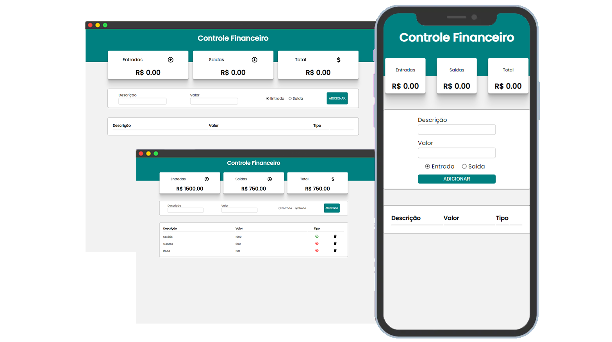
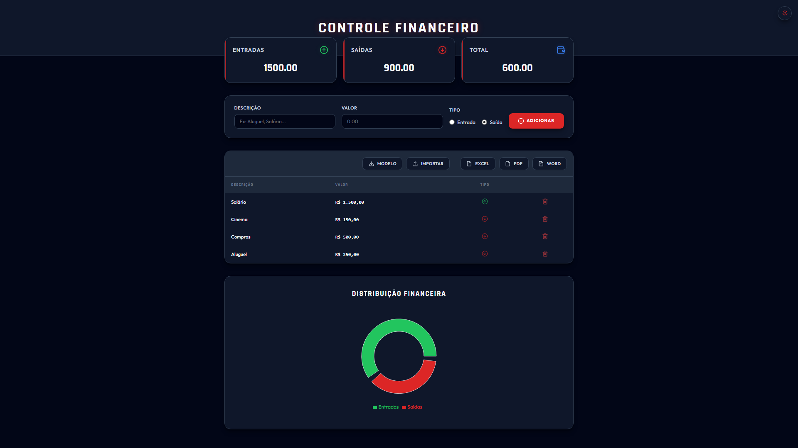
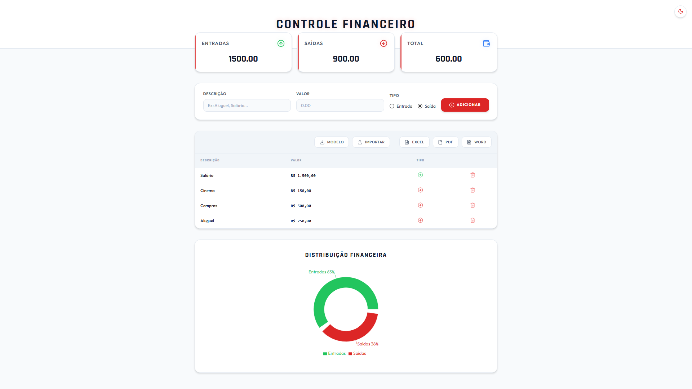
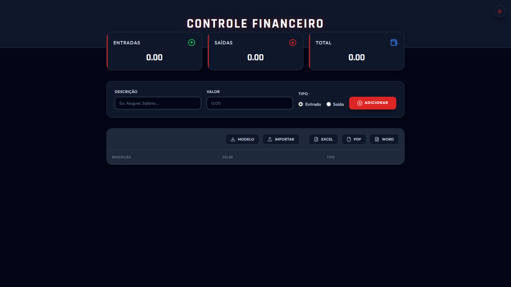
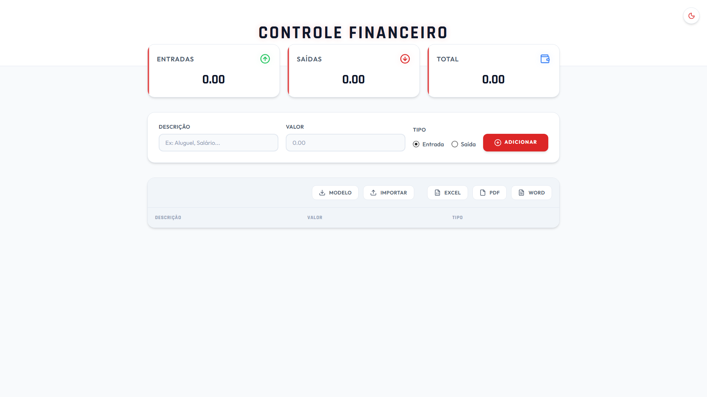

<h1 align="center">💰 Controle Financeiro</h1>

<p align="center">
  Dashboard completo para gerenciar suas finanças pessoais — com gráfico, temas, animações, exportação e importação de dados.
</p>

<div align="center">

  [](https://financas-reactjs.vercel.app)
  [](https://github.com/https-shini/financas-reactjs)
  [](./LICENSE)

</div>

---

<div align="center">
  
</div>

---

## 📌 O que é este projeto?

O **Controle Financeiro** é uma aplicação web construída com ReactJS para registrar e visualizar suas finanças pessoais. Você adiciona entradas e saídas, acompanha seu saldo em tempo real e pode exportar ou importar suas transações em diferentes formatos.

Os dados ficam **salvos automaticamente** no navegador — mesmo após fechar a aba, tudo continua lá na próxima vez que acessar.

---

## ✨ Funcionalidades

- Adicionar transações com **descrição**, **valor** e **tipo** (entrada ou saída)
- Painel de **resumo** com cards de Entradas, Saídas e Saldo total
- Saldo fica **vermelho** quando as saídas superam as entradas
- **Gráfico de pizza** com a distribuição financeira (aparece quando há transações)
- **Tema claro e escuro** com botão de alternância e preferência salva no navegador
- **Animações** nos cards de resumo com entrada suave (Framer Motion)
- **Persistência** via `localStorage` — os dados não somem ao recarregar a página
- **Excluir** transações individualmente pela listagem
- **Exportar** para Excel, PDF, Word e CSV
- **Importar** transações de uma planilha `.xlsx`
- **Baixar modelo** de planilha para preenchimento correto antes de importar
- Valores formatados em **R$ BRL** na listagem
- **Notificações toast** para sucesso, erro e avisos em cada ação

---

## 🌐 Experimente agora

Você pode usar o projeto sem precisar baixar nada:

👉 **[https://financas-reactjs.vercel.app](https://financas-reactjs.vercel.app)**

Basta abrir o link no navegador e começar a registrar suas finanças!

---

## 🖼️ Preview

| Tela inicial | Com transações |
|---|---|
|  |  |

| Modo escuro | Modo Claro |
|---|---|
|  |  |

---

## 🛠️ Tecnologias utilizadas

- **ReactJS** — interface com componentes funcionais e hooks
- **Styled Components** — estilização com suporte completo a temas
- **Framer Motion** — animações de entrada nos componentes
- **Recharts** — gráfico de pizza da distribuição financeira
- **Lucide React** — ícones modernos (Trash2, ArrowUpCircle, Sun, Moon...)
- **React Toastify** — notificações de feedback ao usuário
- **SheetJS (XLSX)** — exportação e importação de planilhas Excel
- **jsPDF + jspdf-autotable** — geração de relatórios em PDF
- **docx + file-saver** — exportação para Word
- **DOMPurify** — sanitização de dados contra injeção de conteúdo
- **Vite** — bundler para desenvolvimento rápido

---

## 🗂️ Estrutura de arquivos

```
financas-reactjs/
│
├── index.html                       → Ponto de entrada HTML
├── banner.png                       → Imagem de apresentação
│
└── src/
    ├── index.js                     → Inicialização do React (createRoot)
    ├── App.js                       → Componente raiz com todos os providers
    │
    ├── contexts/
    │   ├── FinanceContext.js        → Estado global das transações (CRUD + localStorage)
    │   └── ThemeContext.js          → Estado global do tema (claro/escuro + localStorage)
    │
    ├── components/
    │   ├── Header/                  → Cabeçalho com título em destaque
    │   ├── ThemeToggle/             → Botão de alternância de tema (Sol/Lua)
    │   ├── Resume/                  → Grid com os 3 cards de resumo financeiro
    │   ├── ResumeItem/              → Card individual (título, ícone, valor)
    │   ├── Form/                    → Formulário de adição de transações
    │   ├── Grid/                    → Tabela de transações com barra de ações
    │   ├── GridItem/                → Linha individual da tabela
    │   └── Chart/                   → Gráfico de pizza (Distribuição Financeira)
    │
    ├── utils/
    │   ├── exportFiles.js           → Exportação para Excel, PDF e Word
    │   ├── exportCsv.js             → Exportação para CSV
    │   └── importFiles.js           → Importação de planilhas + download de modelo
    │
    └── styles/
        ├── global.js                → Estilos globais com transição de tema
        └── theme.js                 → Tokens de cores, sombras e tipografia dos temas
```

---

## 🧩 Componentes principais

### 💳 ResumeItem
Card que exibe um indicador financeiro. Recebe um ícone do Lucide, título, valor e cor. Tem hover com elevação e uma barra lateral colorida que identifica o tipo.

### 📋 Grid + GridItem
Tabela de transações com barra de ações no topo. Cada linha exibe descrição, valor formatado em BRL, ícone de tipo (verde/vermelho) e botão de exclusão com animação.

### 📊 Chart
Gráfico de pizza com Recharts mostrando a proporção entre entradas e saídas. Só aparece quando há ao menos uma transação cadastrada. O tooltip e as cores seguem o tema ativo.

### 🌗 ThemeToggle
Botão circular no canto superior direito do header. Alterna entre os ícones Sol e Lua com animação de escala ao clicar (Framer Motion).

---

## 🎨 Sistema de temas

O app possui dois temas completos com tokens de design:

| Token | Tema Claro | Tema Escuro |
|---|---|---|
| Fundo | `#f8fafc` | `#020617` |
| Superfície | `#ffffff` | `#0f172a` |
| Texto | `#0f172a` | `#f8fafc` |
| Primário | `#dc2626` | `#dc2626` |
| Sucesso | `#22c55e` | `#22c55e` |
| Borda | `#e2e8f0` | `#334155` |

As fontes utilizadas são **Outfit** (textos) e **Rajdhani** (títulos e valores).

---

## 📤 Exportação de dados

| Formato | Arquivo gerado | Biblioteca |
|---|---|---|
| **Excel** | `controle_financeiro.xlsx` | SheetJS |
| **PDF** | `controle_financeiro.pdf` | jsPDF |
| **Word** | `controle_financeiro.docx` | docx |
| **CSV** | `transacoes_financeiras.csv` | Nativa |

---

## 📥 Importação de dados

Importe transações de uma planilha `.xlsx`. O formato esperado é:

| Descrição | Valor | Tipo (Entrada/Saída) |
|---|---|---|
| Salário | 5000 | Entrada |
| Aluguel | 1200 | Saída |

> 💡 Clique em **"Modelo"** dentro do app para baixar uma planilha já formatada corretamente.

Os dados importados são **validados e sanitizados** automaticamente — valores inválidos são ignorados e o conteúdo é protegido contra injeção via DOMPurify.

---

## 🚀 Como rodar localmente

**1. Clone o repositório**
```bash
git clone https://github.com/https-shini/financas-reactjs.git
cd financas-reactjs
```

**2. Instale as dependências**
```bash
npm install
```

**3. Inicie o servidor de desenvolvimento**
```bash
npm run dev
```

**4. Acesse no navegador**
```
http://localhost:5173
```

---

## 🤝 Como contribuir

Consulte o arquivo [CONTRIBUTING.md](./CONTRIBUTING.md) para o passo a passo completo.

```bash
git checkout -b minha-feature
git commit -m "feat: minha nova feature"
git push origin minha-feature
# Abra um Pull Request 🚀
```

---

## 📄 Licença

Este projeto está sob a licença **MIT**. Veja o arquivo [LICENSE](./LICENSE) para mais detalhes.

---

<div align="center">

Feito com 💙 — organize suas finanças de forma simples e visual!

⭐ Se gostou, deixe uma estrela no repositório!

</div>


